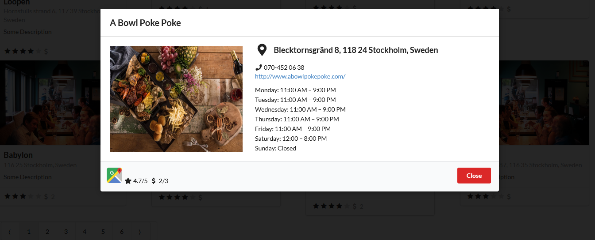

# bulbasaur

This project was created with React, Redux, Nodejs, MongoDB, Visual Studio Code and Postman.

# Available Scripts

## Server
In the root directory, through `git bash` or `terminal` you can run 
### `node server` 
or 
### `nodemon server`
to run the app in the development mode on port `8080`.

## Client
In the `frontend` directory, through `git bash` or `terminal` you can run
### `npm start`
to run the app in development mode.
Open [http://localhost:3000](http://localhost:3000) to view it in the browser.
To have alongide a running server, the react app contains a `proxy` in its `package.json`

# How To Set Up The Project

### Set Up MongoDB Database
1. Install MongoDB https://docs.mongodb.com/manual/administration/install-community/
2. Navigate to the project folder with a `terminal`
3. Import the Restaurants database from 'mongodb/db.json' file.
4. If the terminal did not recognize mongo commands, install MongoDB Database Tools https://www.mongodb.com/try/download/database-tools

### Set Up the Server
1. Install node dependenices `npm install`, the following `npm` dependencies are important: `body-parser`, `cors`, `dotenv`, `express`, `mongodb` `mongoose`, `morgan`.
2. If everything was installed, the server will display in terminal: `Server running on port: 8080` and `MongoDB Connection Success!`

### Set Up the Client
1. Navigate to `frontend` folder of the project with a terminal.
2. Install npm dependencies `npm install`
3. Install `npm react-redux`, `npm redux`, `npm redux-thunk`, `npm semantic-ui-react` and `npm semantic-ui-css`
4. Bear with me.
5. Open with an editor the 'package.json' file and insert the following key `"proxy": "http://localhost:8080"` inside the object.

# Start the project
1. Open two terminals: one will be for the server and the other for the react app
2. First start the server then the client.
3. Server terminal: navigate to project folder and run `node server` or `nodemon server` (if you installed `npm nodemon`)
4. Client terminal: navigate to 'frontend' folder and `npm start`
5. The app will open automatically in browser, if not open [http://localhost:3000](http://localhost:3000) to view it in the browser.

# Demo

## Default state when app is open

## Filter by restaurants open all week

## Filter by restaurants open all week and sort by price level ascending

## Click on a restaurant card to open a modal with information

## Dynamic Pagination

